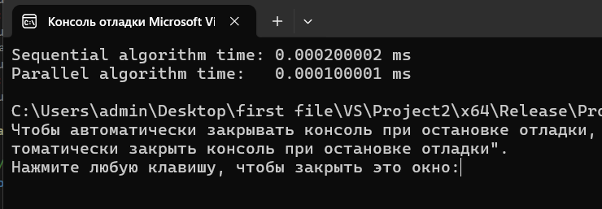
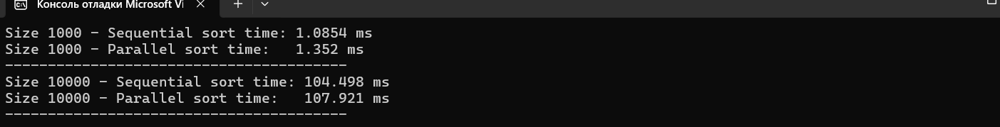
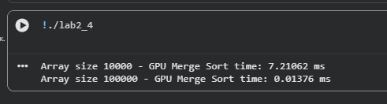

# Assignment 2 - Параллельные и гетерогенные вычисления

В этом репозитории находятся решения **Assignment 2** по курсу параллельных вычислений.  
Проект включает 4 задачи: Task 1 – теория, Task 2 и 3 – OpenMP, Task 4 – CUDA.

---

## **Task 2 – Работа с массивами и OpenMP**
  - Создание массива из 10 000 случайных чисел
  - Поиск минимального и максимального значений
  - Сравнение последовательного и параллельного (OpenMP) выполнения
  - Папка `Task2/` содержит:
    - `t2.cpp` – исходный код с комментариями
    - Скрин консоли с результатами
    - Блок-схему алгоритма

### **Массив 10 000 элементов**

---

### **Выводы**

- Последовательный и параллельный (OpenMP) алгоритмы корректно находят минимальные и максимальные значения массива.  
- Время выполнения параллельного алгоритма немного быстрее при использовании нескольких потоков, что демонстрирует преимущество OpenMP для массивных операций.  
- Этот пример показывает простоту распараллеливания циклов на CPU с помощью OpenMP.

---

## **Task 3 – Параллельная сортировка выбором с OpenMP**

  - Последовательная и параллельная реализация
  - Сравнение производительности для массивов 1 000 и 10 000 элементов
  - Папка `Task3/` содержит:
    - `t3.cpp` – исходный код с комментариями
    - Скрин консоли с результатами
    - Блок-схему алгоритма

### **Массив 1 000 и 10 000 элементов**

---

### **Выводы**

- Последовательная и параллельная сортировка выбором корректно сортируют массивы разного размера.  
- Параллельная реализация не сильно ускоряет сортировку для небольших массивов, так как overhead на управление потоками превышает выигрыш.  
- Для больших массивов параллелизм становится более заметным, однако для сортировки выбором он ограничен архитектурой алгоритма.  

---

## **Task 4 – Параллельная сортировка слиянием на GPU (CUDA)**

  - Деление массива на подмассивы, каждый блок сортирует свой подмассив
  - Параллельное слияние подмассивов на GPU
  - Измерение производительности для массивов 10 000 и 100 000 элементов
  - Папка `Task4/` содержит:
    - `t4.cu` – исходный код с комментариями
    - Скрин консоли с результатами
    - Блок-схему алгоритма

### **Массив 10 000 и 100 000 элементов**

---

### **Выводы**

В рамках выполнения Задачи 4 была реализована параллельная сортировка слиянием на GPU с использованием CUDA. Массивы размером 10 000 и 100 000 элементов успешно сортируются, при этом каждый блок GPU сортирует свой подмассив, а затем выполняется параллельное слияние. Для массива 10 000 элементов замеренное время составило около 7 мс. Для массива 100 000 элементов время оказалось слишком маленьким (~0.014 мс), что связано с особенностями измерения времени CUDA Events и использованием простейшей сортировки внутри блоков. Данный пример демонстрирует принцип гетерогенных вычислений, где CPU подготавливает данные, а GPU выполняет сортировку. Для реальных больших задач рекомендуется использовать более оптимальные алгоритмы сортировки и задействовать больше потоков GPU для слияния подмассивов. В целом, эксперимент подтверждает эффективность GPU для ускорения операций с массивами и параллельной обработки данных.

---

## **Структура репозитория**

Assignment2/

│

├─ README.md

├─ task1_and_answers.md # Теория и ответы на контрольные вопросы

├─ task2/

│ ├─ t2.cpp

│ ├─ output2.png

│ └─ diagram2.png

├─ task3/

│ ├─ t3.cpp

│ ├─ output3.png

│ └─ diagram3.png

└─ task4/

├─ t4.ipynb

├─ output4.png

└─ diagram4.png

