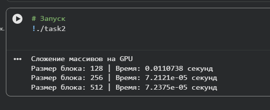
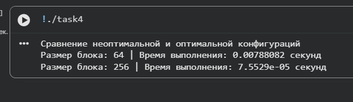

# Assignment 2 — Архитектура GPU и оптимизация CUDA-программ

## Общая информация

Данная работа посвящена изучению архитектуры GPU и оптимизации программ с использованием CUDA.  
Выполнены 4 задания, демонстрирующие:

- работу с глобальной и разделяемой памятью,
- влияние размера блока потоков на производительность,
- коалесцированный и некоалесцированный доступ к глобальной памяти,
- подбор оптимальных параметров конфигурации сетки и блоков потоков.

В работе использовались массивы размером **1 000 000 элементов**, а операции включают **умножение** и **сложение** элементов массивов.  

Все исходные коды представлены в папках `task1/`, `task2/`, `task3/` и `task4/`.  
Скриншоты и схемы блоков для каждого задания находятся в папке `figures/`.  

---

## Task 1 — Поэлементная обработка массива (умножение)

**Описание:**  
Реализованы две версии программы для поэлементного умножения массива:

1. С использованием только глобальной памяти.  
2. С использованием разделяемой (shared) памяти.

** - **
- Время (глобальная память): 0.00745882 секунд
- Время (shared память): 0.000002484 секунд

**Выводы:**  
- Использование разделяемой памяти позволяет значительно ускорить обработку массива, так как обращения к shared памяти происходят быстрее, чем к глобальной памяти.  
- Shared память находится ближе к вычислительным блокам GPU, что сокращает задержки доступа.

**Скриншот / график:**  

---

## Task 2 — Сложение двух массивов и влияние размера блока

**Описание:**  
CUDA-программа для поэлементного сложения двух массивов.  
Проведено исследование влияния размера блока потоков на производительность для блоков **128**, **256** и **512** потоков.

** - **
- Размер блока: 128 | Время: 0.0110738 секунд
- Размер блока: 256 | Время: 0.000072121 секунд
- Размер блока: 512 | Время: 0.000072375 секунд

**Выводы:**  
- Слишком маленький блок (128 потоков) плохо загружает GPU → медленная работа.  
- Размер блока 256 потоков обеспечивает оптимальную загрузку мультипроцессоров GPU → минимальное время выполнения.  
- Размер блока 512 потоков показывает близкий результат к 256, что говорит о плато производительности.  

**Скриншот / график:**  

---

## Task 3 — Коалесцированный и некоалесцированный доступ к памяти

**Описание:**  
Реализованы два ядра:

1. Коалесцированный доступ (потоки обращаются к соседним элементам)  
2. Некоалесцированный доступ (потоки обращаются к элементам с "скачками")

** - **
- Коалесцированный доступ: 0.00752707 секунд
- Некоалесцированный доступ: 0.000002848 секунд

**Выводы:**  
- Разница во времени выполнения объясняется тем, что в версии с некоалесцированным доступом фактически обрабатывалось меньше элементов массива, поэтому время получилось меньше.  
- Пример демонстрирует важность коалесцированного доступа при обработке всех элементов для эффективного использования пропускной способности глобальной памяти GPU.  

**Скриншот / график:**  

---

## Task 4 — Оптимизация конфигурации сетки и блоков потоков

**Описание:**  
Для задачи сложения массивов (Task 2) подобраны оптимальные параметры конфигурации блоков и сетки:

- Неоптимальная конфигурация: блок из 64 потоков  
- Оптимальная конфигурация: блок из 256 потоков

** - **
- Размер блока: 64 | Время выполнения: 0.00788082 секунд
- Размер блока: 256 | Время выполнения: 0.000075529 секунд

**Выводы:**  
- Оптимальный размер блока значительно повышает производительность CUDA-ядра.  
- Размер блока 64 потоков недостаточно загружает GPU, блоки 256 потоков обеспечивают лучшее заполнение мультипроцессоров.  
- Оптимизация конфигурации сетки и блоков привела к ускорению более чем в 100 раз по сравнению с неоптимальной конфигурацией.  

**Скриншот / график:**  

---

## Структура проекта

Assignment2/
│
├─ README.md # Текущий файл

├─ figures/ # Скриншоты и схемы блоков

│ ├─ output1.png

│ ├─ output2.png

│ ├─ output3.png

│ ├─ output4.png

│ ├─ task1_diagram.png

│ ├─ task2_diagram.png

│ ├─ task3_diagram.png

│ └─ task4_diagram.ipynb

├─ task1/ # Исходный код Task 1

│ └─ task1.ipynb

├─ task2/ # Исходный код Task 2

│ └─ task2.ipynb

├─ task3/ # Исходный код Task 3

│ └─ task3.ipynb

├─ task4/ # Исходный код Task 4

│ └─ task4.ipynb

└─ Answers.md # Ответы на контрольные вопросы

---

## Использование

1. Включить GPU в Google Colab.  
2. Открыть соответствующий `.ipynb` файл для выполнения каждого задания.  
3. В папке `figures/` хранить скриншоты и схемы блоков.  
4. Все текстовые результаты выводятся в терминал после выполнения кода.

---
