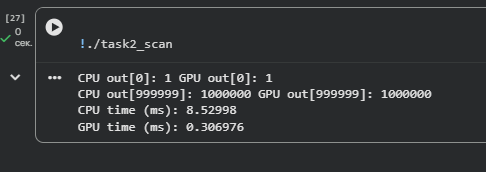

  # Assignment 4  
## Гибридные и распределённые параллельные вычисления

Данный репозиторий содержит выполнение **Assignment 4** по теме  
**гибридных и распределённых параллельных вычислений**.

Все задания реализованы на языке **C++** с использованием **CUDA** и **MPI**  
и оформлены в виде отдельных Jupyter Notebook файлов (`.ipynb`).

---

## Структура проекта

├── task1/

│ ├── task1.ipynb # CUDA: сумма элементов массива

│ └── task1_diagram.png # Блок-схема алгоритма

│

├── task2/

│ ├── task2.ipynb # CUDA: префиксная сумма (scan)

│ └── task2_diagram.png # Блок-схема алгоритма

│

├── task3/

│ ├── task3.ipynb # Гибридная CPU + GPU реализация

│ └── task3_diagram.png # Блок-схема гибридного процесса

│

├── task4/

│ ├── task4.ipynb # MPI: распределённая обработка массива

│ └── task4_diagram.png # Блок-схема MPI-программы

│

├── answers.md # Ответы на контрольные вопросы

└── README.md


---

## Используемые технологии

- **C++**
- **CUDA**
- **MPI (Open MPI)**
- **Google Colab (GPU runtime)**
- **NVIDIA Tesla T4**

---

## Задание 1 — CUDA: сумма элементов массива

**Описание:**  
Реализовано вычисление суммы элементов массива размером `100 000` с использованием CUDA и глобальной памяти.  
Проведено сравнение с последовательной CPU-реализацией.

**Результаты:**

CPU sum: 100000

GPU sum: 100000

CPU time (ms): ~2.5

GPU time (ms): ~0.5


**Вывод:**  
GPU-реализация вычисления суммы массива показала значительно более низкое время выполнения по сравнению с последовательной CPU-версией. Это объясняется тем, что CUDA kernel выполняется параллельно большим количеством потоков, каждый из которых обрабатывает отдельный элемент массива. В то же время CPU выполняет суммирование последовательно, что приводит к линейному росту времени с увеличением объёма данных. Таким образом, использование GPU оправдано для задач, где требуется обработка большого массива однотипных данных.

---

## Задание 2 — CUDA: префиксная сумма (Scan)

**Описание:**  
Реализован алгоритм префиксной суммы для массива размером `1 000 000`  
с использованием разделяемой памяти CUDA.

**Результаты:**

CPU time (ms): ~8.5

GPU time (ms): ~0.3




**Вывод:**  

GPU-реализация префиксной суммы показала существенное ускорение по сравнению с последовательной CPU-версией. Это обусловлено тем, что алгоритм scan эффективно распараллеливается, а использование разделяемой памяти (shared memory) значительно снижает задержки доступа к данным внутри блока. В результате GPU выполняет вычисления быстрее, чем CPU, особенно на больших объёмах данных. Данный эксперимент подтверждает, что для алгоритмов с высокой степенью параллелизма и регулярным доступом к памяти GPU является предпочтительным вариантом.

---

## Задание 3 — Гибридные вычисления (CPU + GPU)

**Описание:**  
Массив данных разделён на две части:
- первая часть обрабатывается на CPU
- вторая часть обрабатывается на GPU

Проведено сравнение CPU-, GPU- и гибридной реализаций.

**Результаты:**

CPU time (ms): ~90.7

GPU time (ms): ~3.5

Hybrid time (ms): ~74.8


**Вывод:**  
Гибридная реализация показала время выполнения ниже, чем у чисто CPU-версии, но выше, чем у чисто GPU-версии. Это связано с тем, что часть данных обрабатывается на CPU, а часть — на GPU, однако общая производительность ограничивается накладными расходами на передачу данных между CPU и GPU, а также синхронизацией выполнения. Кроме того, поскольку GPU сам по себе быстрее CPU для данной задачи, добавление CPU-части не даёт прироста производительности выше GPU. Тем не менее гибридный подход полезен, когда данные слишком велики для полного размещения на GPU или когда часть алгоритма лучше выполняется на CPU.

---

## Задание 4 — MPI: распределённые вычисления

**Описание:**  
Реализована распределённая программа с использованием MPI.  
Массив данных разделяется между процессами, локальные результаты собираются с помощью `MPI_Reduce`.

**Результаты:**

2 процесса → ~68.9 ms

4 процесса → ~43.7 ms

8 процессов → ~33.7 ms


**Вывод:**  
При увеличении числа MPI-процессов наблюдается уменьшение времени выполнения, что подтверждает эффективность распределения вычислений. Каждый процесс получает часть массива и вычисляет локальную сумму, после чего результаты объединяются с помощью MPI_Reduce. Ускорение происходит за счёт параллельной обработки данных. Однако масштабируемость ограничена накладными расходами на коммуникацию и синхронизацию процессов, поэтому при слишком большом числе процессов выигрыш может уменьшаться. В условиях Google Colab, где доступно ограниченное количество ядер, использование опции --oversubscribe позволило запускать больше процессов, но в реальных кластерах масштабирование будет зависеть от сетевой инфраструктуры и объёма данных.

---

## Контрольные вопросы

Ответы на контрольные вопросы представлены в файле:

answers.md


---

## Запуск

Все `.ipynb` файлы предназначены для запуска в **Google Colab**  
с включённым режимом **GPU**.

Для MPI используется команда:

```bash
mpirun --allow-run-as-root --oversubscribe -np 4 ./task4_mpi


