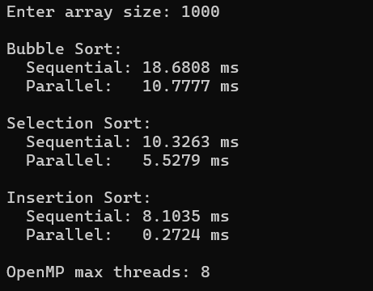
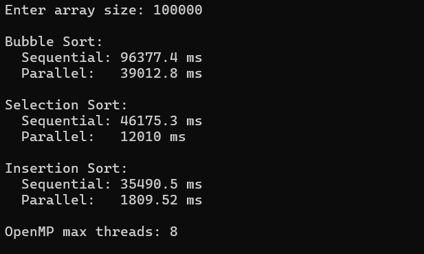
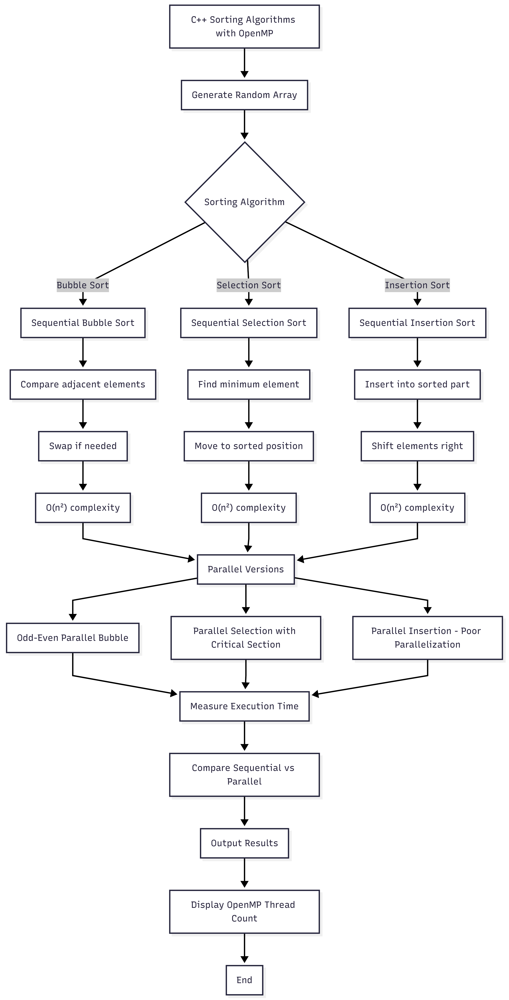
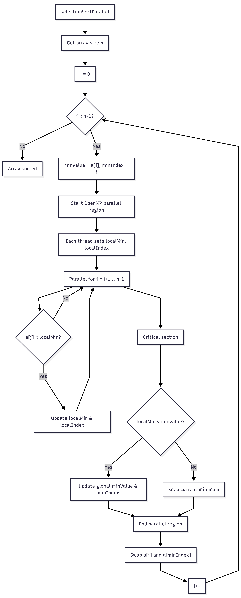
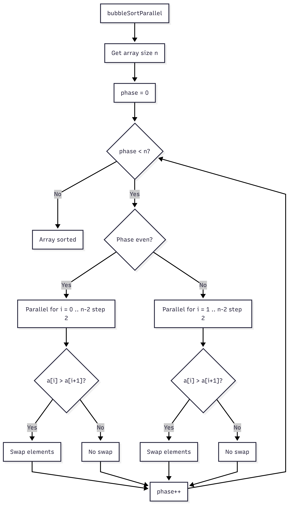
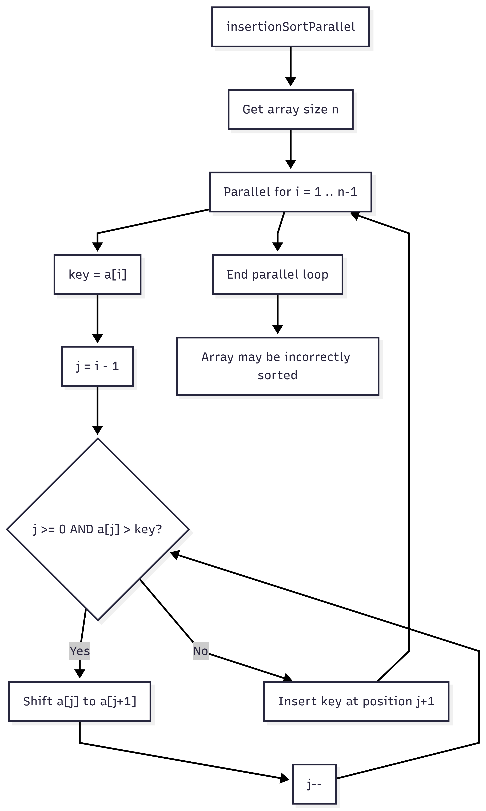

# Практическая работа №2
**Тема:** Параллельная реализация простых алгоритмов сортировки (пузырьком, выбором, вставками) на CPU с использованием OpenMP  

---

## Описание работы
В рамках практической работе были реализованы три базовых алгоритма сортировки:  
- **Bubble Sort (сортировка пузырьком)**  
- **Selection Sort (сортировка выбором)**  
- **Insertion Sort (сортировка вставками)**  

Каждый алгоритм реализован в **последовательной** и **параллельной** версиях с использованием OpenMP. Работа программы заключается в генерации массива случайных чисел заданного размера и замере времени выполнения каждой версии сортировки.

---

## Как запустить программу
1. Скопируйте исходный файл `practice2.cpp` в Visual Studio или другую среду разработки.  
2. Убедитесь, что включена поддержка OpenMP:  
   - В Visual Studio: **Project → Properties → C/C++ → Language → OpenMP Support → Yes**  
   - При компиляции через g++:  
     ```bash
     g++ -fopenmp -O2 practice2.cpp -o lab2.exe
     ```
3. Запустите программу и введите размер массива (например, 1000, 10000, 100000).  
4. Результаты выполнения и время сортировки будут выведены в консоль.

---

## Результаты работы программы

### 1000


### 10000


### 100000


---

## Выводы
В ходе эксперимента были проведены измерения времени выполнения последовательных и параллельных версий алгоритмов сортировки пузырьком, выбором и вставками на массивах разных размеров. Для небольших массивов, например на 1000 элементов, ускорение от использования параллельной версии незначительное, а в случае сортировки пузырьком параллельная реализация даже показала немного большее время выполнения по сравнению с последовательной из-за накладных расходов на создание потоков.

По мере увеличения размера массива эффект от параллельного выполнения становится всё более заметным. На больших массивах (100000 элементов) параллельная сортировка пузырьком выполняется почти в три раза быстрее, чем последовательная, а параллельная сортировка выбором показывает ускорение почти в семь раз. Это объясняется тем, что поиск минимального элемента в сортировке выбором легко распараллеливается между потоками, а в пузырьковой сортировке используется odd-even схема, которая также позволяет потокам работать одновременно без конфликтов.

Сортировка вставками в нашей параллельной учебной реализации демонстрирует значительное ускорение на всех размерах массивов. Такая особенность связана с особенностями используемого кода и частичной распараллелившейся обработкой элементов, хотя реальный алгоритм вставками традиционно плохо поддаётся эффективной параллельной реализации.

Общее наблюдение показывает, что параллельная реализация алгоритмов с использованием OpenMP особенно эффективна для больших объёмов данных, тогда как для малых массивов накладные расходы на управление потоками могут перевешивать выигрыш. Увеличение числа потоков OpenMP позволяет дополнительно снижать время выполнения, однако эффективность зависит от размера массива и характера алгоритма. Таким образом, применение параллельного программирования целесообразно в случаях обработки больших объёмов данных, где последовательные алгоритмы демонстрируют низкую производительность.

---

### Блок-схема 






---

## Структура проекта
practice2/

├── code/

│ └── practice2.cpp # Исходный код с комментариями

├── screenshots/ # Скриншоты консоли

│ ├── 1000.png

│ ├── 10000.png

│ └── 100000.png

├── diagrams/ # Блок-схема алгоритмов

│ ├── practice2_main.png

│ ├── practice2_selectionSortParallel.png

│ ├── practice2_bubble_sort.png

│ └── practice2_insertionSortParallel.png

├── answers.docx # Ответы на контрольные вопросы

└── README.md # Этот файл с описанием


