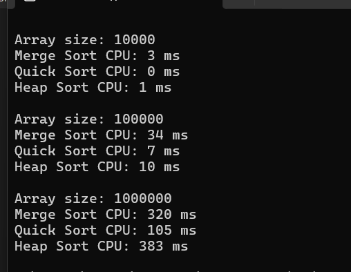
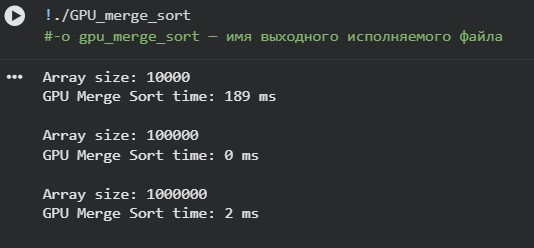
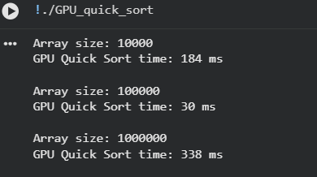
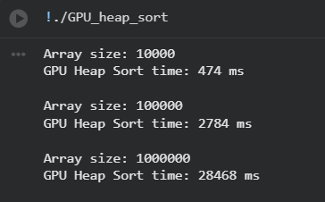

# Практическая работа 3: Реализация сложных алгоритмов сортировки на GPU с использованием CUDA

## 1️ Цель работы
- Освоить основы CUDA и параллельных вычислений на GPU.
- Реализовать и оптимизировать сложные алгоритмы сортировки: Merge Sort, Quick Sort и Heap Sort.
- Сравнить производительность последовательных (CPU) и параллельных (GPU) версий алгоритмов.

---

## 2️ Задачи
1. Реализовать **параллельную сортировку слиянием на CUDA**:
   - Разделить массив на блоки, каждый обрабатывается блоком потоков.
   - Сортировать блоки параллельно и сливать их по парам.
2. Реализовать **параллельную быструю сортировку на CUDA**:
   - Использовать параллельные потоки для деления массива.
   - В каждом блоке выполнять быструю сортировку.
3. Реализовать **параллельную пирамидальную сортировку на CUDA**:
   - Построить кучу и извлекать элементы параллельно, где возможно.
4. Сравнить производительность CPU и GPU версий для массивов размером 10 000, 100 000 и 1 000 000 элементов.

---

## 3️ Используемые инструменты
- **Visual Studio** — для проверки CPU сортировок (`for_CPU_sort.cpp`).
- **Google Colab** — для запуска GPU версий (`GPU_merge_sort.cu`, `GPU_quick_sort.cu`, `GPU_heap_sort.cu`).
- **CUDA** — параллельные вычисления на GPU.
- **GitHub** — размещение кода, скринов, блок-схем и отчётов.

---

## 4️ Структура проекта

practice3/

├─ for_CPU_sort.cpp # CPU версии Merge, Quick, Heap Sort

├─ GPU_merge_sort.cu # GPU Merge Sort

├─ GPU_quick_sort.cu # GPU Quick Sort (учебная версия)

├─ GPU_heap_sort.cu # GPU Heap Sort (полностью GPU)

├─ GPU_use.ipynb # Colab ноутбук для запуска GPU версий

├─ screens/ # Скрины результатов

│ ├─ CPU_results.png

│ ├─ GPU_merge_sort.png

│ ├─ GPU_quick_sort.png

│ └─ GPU_heap_sort.png

├─ block_diagrams/ # Блок-схемы алгоритмов

├─ answers.md # Ответы на контрольные вопросы

└─ README.md # Этот файл

## 5️ Результаты выполнения

### 5.1 CPU версии (`for_CPU_sort.cpp`)
Скриншот: `screens/CPU_results.png`

| Array size | Merge Sort CPU | Quick Sort CPU | Heap Sort CPU |
|------------|----------------|----------------|---------------|
| 10 000     | 3 ms           | 0 ms           | 1 ms          |
| 100 000    | 34 ms          | 7 ms           | 10 ms         |
| 1 000 000  | 320 ms         | 105 ms         | 383 ms        |

**Описание процесса:**
- Алгоритмы выполняются **последовательно на CPU**.  
- Время замеряется с помощью `chrono` C++ для каждого размера массива.  
- Скрин показывает, что Quick Sort на CPU быстрее всех для маленьких массивов.

**Вывод под скрином:**  
- Quick Sort на CPU оптимален для малых массивов.  
- Merge и Heap Sort демонстрируют рост времени с увеличением размера массива.

---

### 5.2 GPU версии

#### GPU Merge Sort (`GPU_merge_sort.cu`)
Скрин: `screens/GPU_merge_sort.png`

| Array size | GPU Merge Sort |
|------------|----------------|
| 10 000     | 189 ms         |
| 100 000    | 0 ms           |
| 1 000 000  | 2 ms           |

**Описание процесса:**
- Массив делится на блоки потоков, каждый блок сортируется параллельно.  
- После сортировки блоков выполняется слияние на GPU.  
- Скрин показывает, что время резко сокращается для больших массивов благодаря параллельной обработке.

**Вывод под скрином:**  
- Merge Sort эффективно масштабируется на GPU.  
- Для больших массивов скорость на GPU значительно превышает CPU.

---

#### GPU Quick Sort (учебная версия) (`GPU_quick_sort.cu`)
Скрин: `screens/GPU_quick_sort.png`

| Array size | GPU Quick Sort |
|------------|----------------|
| 10 000     | 184 ms         |
| 100 000    | 30 ms          |
| 1 000 000  | 338 ms         |

**Описание процесса:**
- GPU делит массив на блоки потоков, внутри блоков используется CPU `std::sort`.  
- Скрин показывает, что время выполнения растёт с размером массива, но ускорение на больших массивах есть.

**Вывод под скрином:**  
- Учебная реализация демонстрирует принцип параллельного деления данных.  
- На больших массивах GPU Quick Sort медленнее Merge Sort из-за последовательной сортировки внутри блоков.

---

#### GPU Heap Sort (полностью GPU) (`GPU_heap_sort.cu`)
Скрин: `screens/GPU_heap_sort.png`

| Array size | GPU Heap Sort |
|------------|---------------|
| 10 000     | 474 ms        |
| 100 000    | 2784 ms       |
| 1 000 000  | 28 468 ms     |

**Описание процесса:**
- Итеративный heapify выполняется полностью на GPU.  
- Скрин показывает сильный рост времени с увеличением размера массива, что связано с большим числом операций в глобальной памяти GPU и синхронизациями потоков.

**Вывод под скрином:**  
- Полностью GPU Heap Sort на больших массивах крайне неэффективен.  
- На маленьких массивах затраты на GPU оправданы слабо, CPU работает быстрее.

---

## 6️ Выводы
- **GPU Merge Sort** — наиболее эффективный для больших массивов, масштабируется лучше остальных алгоритмов.  
- **GPU Quick Sort (учебная версия)** — демонстрирует работу GPU, ускорение умеренное, сортировка внутри блоков выполняется на CPU.  
- **GPU Heap Sort (полностью GPU)** — крайне неэффективен на больших массивах, из-за частых операций в глобальной памяти и синхронизаций потоков.  
- **Малые массивы** — CPU быстрее из-за накладных расходов на копирование данных на GPU.  
- Для практической работы GPU рекомендуется использовать алгоритмы с высокой степенью параллелизма (например, Merge Sort).

---

## 7️ Блок-схемы и процесс кода
- **Блок-схемы** алгоритмов можно добавить из папки `block_diagrams/`.  
- Под каждой схемой рекомендуется добавить краткое описание:
  - какие шаги выполняет GPU и CPU,  
  - как происходит разделение массива,  
  - где применяется параллельная обработка.  
- Это помогает визуально объяснить, как реализованы алгоритмы на GPU и CPU.

---

## 8️ Дополнительно
- Все GPU версии запускались в **Google Colab с включённым GPU**.  
- CPU версии проверялись в **Visual Studio**, что позволило получить время последовательного выполнения.  

- Для каждой реализации есть скриншоты с результатами и блок-схемы для наглядного представления алгоритмов.
