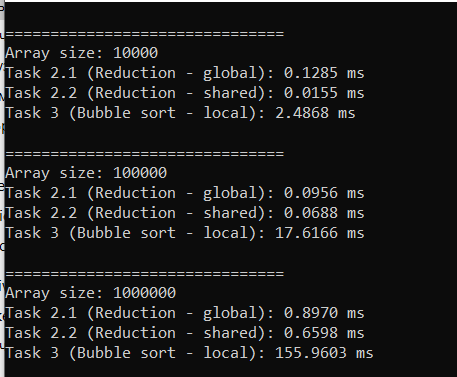
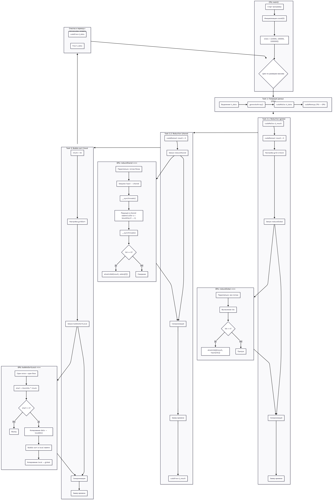

```markdown
# Практическая работа №4 — Оптимизация параллельного кода на GPU

## Описание проекта
Цель работы: изучение и использование различных типов памяти CUDA (глобальная, разделяемая, локальная) для оптимизации параллельных вычислений на GPU.

В работе реализованы следующие задачи:

1. **Генерация массива случайных чисел** (Задание 1)  
2. **Редукция суммы элементов массива** (Задание 2)  
   - 2.1 — только глобальная память  
   - 2.2 — комбинация глобальной и разделяемой памяти  
3. **Сортировка пузырьком для подмассивов** (Задание 3) с использованием локальной памяти  
4. **Измерение производительности** для массивов разного размера (10,000; 100,000; 1,000,000 элементов)  

---

## Структура репозитория

```

practice4/
│
├─ code.cu          # Основной CUDA код
├─ README.md        # Этот файл
├─ answer.md        # Контрольные вопросы и ответы
├─ output.png          # Скриншоты с результатами выполнения
└─ diagram.png         # Диаграммы блок-схем алгоритмов

```

---

## Инструкции по запуску

1. Убедитесь, что у вас установлена **CUDA Toolkit** и настроена Visual Studio или другая среда с поддержкой CUDA.
2. Клонируйте репозиторий:
```

git clone <URL репозитория>

```
3. Перейдите в папку проекта и соберите CUDA код.
4. Запустите `code.cu`. Программа выведет время выполнения всех заданий для разных размеров массивов.

---

## Результаты выполнения

```

===============================
Array size: 10000
Task 2.1 (Reduction - global): 0.1285 ms
Task 2.2 (Reduction - shared): 0.0155 ms
Task 3 (Bubble sort - local): 2.4868 ms

===============================
Array size: 100000
Task 2.1 (Reduction - global): 0.0956 ms
Task 2.2 (Reduction - shared): 0.0688 ms
Task 3 (Bubble sort - local): 17.6166 ms

===============================
Array size: 1000000
Task 2.1 (Reduction - global): 0.8970 ms
Task 2.2 (Reduction - shared): 0.6598 ms
Task 3 (Bubble sort - local): 155.9603 ms

```
**Скриншот:**  



```

**Выводы:**
- Использование разделяемой памяти значительно ускоряет редукцию по сравнению с глобальной памятью.  
- Локальная память при сортировке подмассивов позволяет снизить задержки, однако для очень больших массивов сортировка пузырьком остаётся медленной.  
- Время выполнения масштабируется с размером массива, что видно на примере трёх размеров.


---

## Дополнительно

- В папке `diagram/` находятся блок-схемы алгоритмов:
  - Редукция суммы элементов (глобальная и shared память)  
  - Сортировка пузырьком для подмассивов с локальной памятью  
- В папке `output/` находятся скриншоты вывода программы и замеры времени.  
- В `answer.md` приведены ответы на контрольные вопросы по теории CUDA.

---

## Контрольные вопросы

Вопросы и ответы по типам памяти, доступу, оптимизации и профилированию CUDA-программ вынесены в отдельный файл `answer.md`.
```

--- 

**График:**  


---
